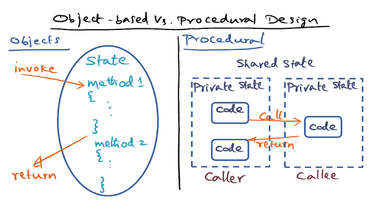
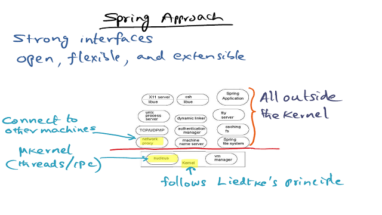
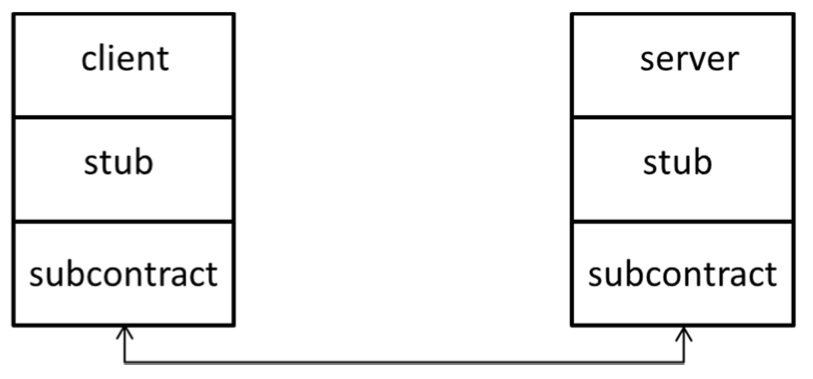
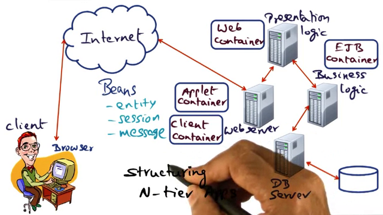
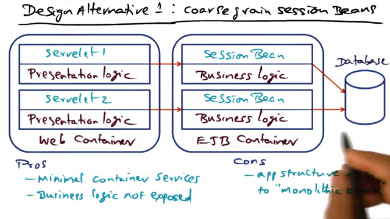
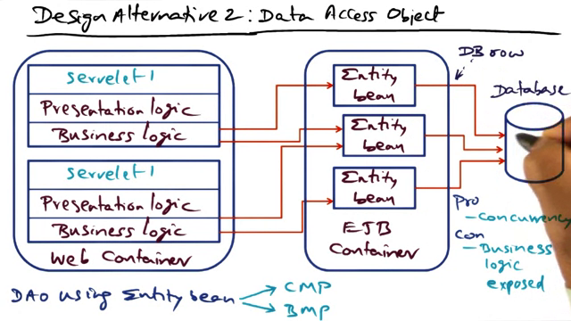
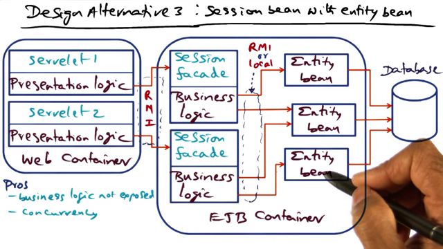

 L06 Distributed Objects and Middleware
======================================
1) Spring System	
2) Distributed Object Model for Java	
3) Enterprise Java Beans

Spring Operating System
-----------------------

### Videos

- How to innovate OS in the commercial space?
	- In a commercial space, the choice becomes whether to build a new OS or to build a better implementation of an existing OS?
	- The question becomes should we build a brand new OS or build a better implementation of a known OS?
=> Marketplace demand says that, well, there are legacy applications that are running on your current operating system and therefore building a brand new operating system may not be that viable in an industrial setting.  So the approach they took in the Spring system at Sun Microsystems, is to be different but innovate where it makes sense.

	- Due to the installed base of applications, moving to a new OS is not a teneable option. Sun, therefore too the latter approach with Spring.
	- The space that Spring was intended for was large scale commercial applications - the staple for Sun's customer base. The OS therefore had to run existing applications unchanged and yet allow for them to be scaled to larger capacities via clusters.
	- [2:57] Sun wanted to build a network OS during the time when the industry was moving to services provided on the network. So they wanted to build an OS that worked on one machine and more using the same Unix API.
	- It also had to allow for 3rd party vendors being able to use the API exposed optimally without breaking anything.
	- Ie, keep all the good things, but add innovation and flexiblity.
	- OO is a good choice for this by keeping this "under the covers".
- Object-based vs Procedural Design
	
	- Monolithic kernels are built with state strewn all over the subsystems that make up the kernel. With OO design, state is contained within objects and methods inside the object manipulate the state. Only the methods are visible externally.
	- Thus you get strong interfaces and isloation of state.
	- However, what about the border crossing cost? Ans TBD to later.
- Spring built kernel components using OO Technology.
- Spring came out as Sun Solaris' MC product. See [Khalidi's paper](https://www.usenix.org/legacy/publications/library/proceedings/sd96/full_papers/khalidi.ps)
- Spring Approach

### Papers

6.1.Spring.pdf:

- intro: choice between start fresh and better impl => choose latter. probs with impl are cost of maint, bad security, difficulty to change, lack of real-time processing support, no unified way of refering to things. but good things are portablilty, acccess to existing systems, etc. So new system should be OO, flexible and extensible. therefore, spring has:
	- idl for interface description
	- microkernel nucleus for process and thread abstraction
	- all parts of the system implemented as object managers.
- idl: simlar to omg idl. idl compiler creates 3 outputs: lang-specific form of the idl interface, client side stub, server side skeleton.
- objects in spring: could be in the same or different address space from the client.
	- server-based objects: are in separate addr space from client. use doors to communicate with the actual servers.
	- serverless objects: are info that can be stored in client space, so its more like a lookup.
	- subcontract: is the low level runtime that allows swappable logic at that level. 
- overall system structure: nucleus(domains, threads and/or doors), Virtual memory manager. everything else is written as user level objects, as per Liedke
- nucleus: consists of domains (process abstraction), thread and doors(pieces of protected nucleus state)
	- doors: doors are pieces of protected nucleus status. 1 door can be ref by many. valid door id = run even if not original accessor. or you can get it from actual nucleus. 
	- object invocation via doors: when a call is made from one address space to another, control is passed to the server thread after copying all data inputs. upon completion the control is passed back to the pc there.
- network proxies: client and server can be in two separate addr spaces. both hold refs to a local door that links network proxies that do the actual communictions.
- spring's security model.
- virtual memory
	- overview
	- cache and pager objects
	- maintaining data coherency
- file system
	- file server impl.
- spring naming
- unix emulation
	- libue
	- unix process server
- conclusions

### Exam Qns

1. Distributed Objects and Middleware (10 min, 9 points)
(Spring) In the Spring Kernel, a client-server interaction is represented as shown in this Figure:

Explain the role played by the subcontract in this interaction (bullets please not wordy sentences).
- Replaceable layer in the RPC stack that sits on top of the network layer of the OS
- Performs the heavy-lifting that needs to be done in Marshalling and unmarshalling (args/results) on both
sides by learning the types of objects involved in the RPC call from the client/server stubs above, and
knowing the specifics of the network layer below
- Optimize the marshaling process commensurate with the location of client and server (e.g., shared
memory between them)
- On the server side, interface allows turning language-specific objects (e.g., C++) into Spring objects to
facilitate creation of client objects and communication end-points in the clients.
- On the server side interface allows shutting down the service
- Process incoming calls to the server and after constructing the local state from the communication buffer ,
- Subcontract is  (i.e., dynamic), allowing transparent migration of servers
- Subcontract allows incremental evolution of the server (e.g., singleton, replicated, cached, etc.)
 
   +1.5 for each of b, c, f, g
   +0.5 for each of a, d, e, h
   1 point gratis for some knowledge

2. (2009 final) 2 pts(Choose ONE true statement from the following) Subcontract in Spring Kernel is a mechanism that serves the following purpose

	* It ensures that there is exactly one implementation of a given service
	* It makes client/server interactions location transparent
	* It is the way marshalling and unmarshalling are done in Spring
	           kernel when the client and server are on the same machine

3. (Choose ONE true statement from the following) Spring kernel allows extension of the operating system (i.e., addition of new subsystems and services) via the following method
	* By using C++ as the language to implement the operating system
	* By use of subcontracts as an underlying mechanism for object
	           method invocations
	* By using open language independent interfaces to enable third
	           party software development
4. Answer True/False and explain why that is the case (If you only say True or False you will not receive full credit.)

	- Spring kernel requires all subsystems to be coded in the same programming language
	-  Client/server interaction in Spring is location transparent (i.e., the client and server do not know or care whether they are on the same or different nodes).

Java RMI
---------

### Videos

- key slides are:
	- the local and remote options of exposing a service
	- how RRL works

### Papers

### Exam Qns

1. Answer True/False and explain why that is the case (If you only say True or False you will not receive full credit.)
	- Parameter passing for object invocation has the same semantics for local and remote objects in Java. 
2. One more found in Study Guide.pdf

EJB
---

### Videos

- Key question: we go beyond the concept of OS and ask how to structure the system software for large scale distributed service? This lesson will show how object technology has gone "ballistic" to provide support for every day ecommerce experience.
- focus of this lesson: show how object technology helps structuring such GSS. Lesson 9 & 10 will go into details of GSS themselves.
- Example: Booking a plane ticket. 
	- You go on Expedia to book a plane ticket. They search on multiple airlines and provide options. You're in the process of deciding. At the same time other people might also be considering the same flight and trying to book.
	- So all the issues related to concurrency, transacations and atomicity are present in this simple example - over space and time.
- this pattern of services that need to handle concurrency, txns etc across space and time for multiple requests is quite common and object technology can help handle it.
- such systems are called n-tier systems and they have to handle persistence, txn, caching, clustering, security.

- ejb system structure:

	- client container (browser, thick client)
	- web server
	- ui logic container
	- ejb container
	- dao container
- Design choice to implement GSS:
	- Choice 1: (UI on web) + (session, data access on app)
	
	- Choice 2: (UI,biz logic on web) + (entity on app)
	
	- Choice 3: (UI on web) + (session facade, biz logic, entity on app)
	
- Key takeaway from OS pov: The power of object technology in structuring complex systems and reusing code. ejb allowed developers to write complex apps without worrying about x-cutting concerns such as security, logging, persistence etc.
- hw: understand qualitatively the impact of the 3 design choices on performance, pooling of resources, number of objects, etc.

### Papers

6.4.02-Cecchet-OOPSLA.pdf

### Exam Qns

None in old papers

Work plan
---------

### Resources

1. Videos : 1 h 46 m
2. Papers: 4
3. Quizzes: 1
4. Exam Review Questions: TBD
5. Other resources:
	1. [Khalidi's paper on Spring MC](https://www.usenix.org/legacy/publications/library/proceedings/sd96/full_papers/khalidi.ps)
	1. Old writeup on Doors: http://www.kohala.com/start/papers.others/doors.html
	1. Hamilton et al's Paper on Subcontracts - in reqd reading.
	1. [Wikipedia page on Spring](http://en.wikipedia.org/wiki/Spring_(operating_system))

### Plan

- Videos:
	Suggested pacing: 1w
	Watching 1h 46 m = 106 mins = 15 mins/day for 7 days
		ie 	watch @ 2x speed
			go back and write notes for same time.
- Papers:
	reading: 1 hr
	writing comprehension of paper: 1 hr 
	4 x 2 h = 8 hrs
	to do it in 7 days needs: 1hr 15 min per day.
- Quizzes: 1 x 5 mins  = 5 min
- Research online and piazza: ? hrs
- Review Exam questions : ?

Total: 2 x 4 hrs + 1.7hrs (ie 106 mins) = 9.7 hrs
Breakdown: 1 hr 30 min per day for 7 days.

### Todos

- Summarize how each is an example for Distributed system at this level.
- Read up again about Tornado to connect the comment made by Prof about Objct Tech use there.
- Finish up notes on lectures
- finish reading up khalidi's page
- answer questions:
	* How is border crossing cost handled in Spring?
- Practice drawing the diagrams

Journal
-------

**Thu Mar 13 02:20:59 2014** : 

- Started watching the videos today at about 10 PM CST. 
- Switched to the "Overview of Spring" pdf, but couldnt understand the why behind such a system.
- So searched on the net for Spring MC and came across the Khalidi paper (see below) which explained the commercial reasons better as well as the subsystems that were actually built. This paper also explained how doors actually work.
- Also found the [wikipedia page on Spring](http://en.wikipedia.org/wiki/Spring_(operating_system)) useful in explaining how it is similar to Mach as well as the business rationale.
- Then started reading the Hamilton paper to understand how Subcontracts work.

**Mar-13-2014 08:38 :** Watching vidoes again.
**Thu Apr 17 08:18:30 2014** : Most of video watching done. must read khalidi paper again, however.
AND finish up notes on RMI and spring.pdf paper.
